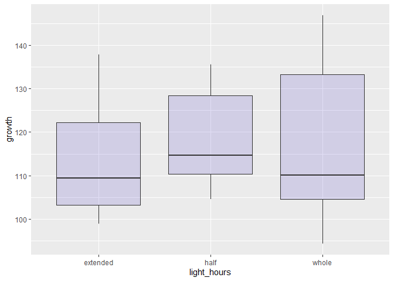
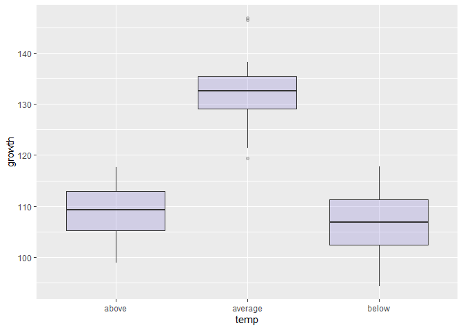
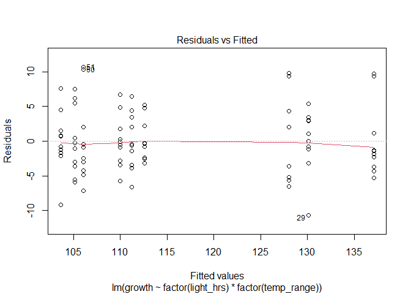
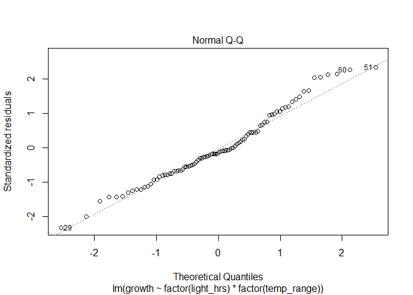
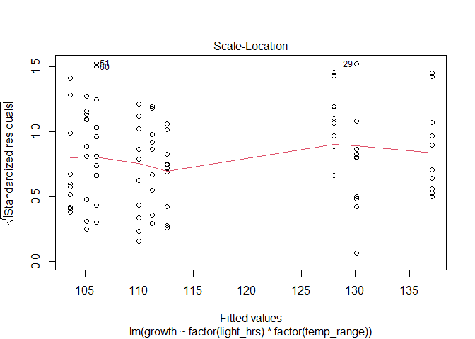
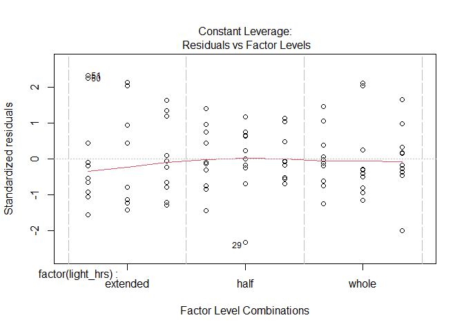

\#SEAInCodeRIntro
================
LaTreese Denson
11/23/2020

## Workshop Goals:

Determine the influence of two environmental factors on species growth.
Provide graphs and tables to summarize findings. Create a function to
automate this analyses.

## Prerequisits;

You should have [R](https://cran.r-project.org) and
[Rstudio](https://www.rstudio.com/products/rstudio/) installed. We will
be working with R within the Rstudio environment.

# Determine, Set, and Create Directories

Determine which directory you are in:

``` r
getwd()
```

    ## [1] "C:/Users/latreese.denson/Documents/Work_Projects/BlackInMarineScienceDec2020"

**ProTip:** Use Ctrl + Enter (Windows) or Cmd + Enter (Mac) to run the
current line of code using a keyboard shortcut.

Not the right directory? That’s fine–let’s change it\!

To change or set the directory in R use the `setwd()` function.

``` r
# The file path for your desktop
setwd("/Users/Me/Desktop")
```

**Note:** In this character string, you can only use a “/” or “\\\\”
between folder names.

For example, to get the directory to a specific folder:

1.  From your desktop or start menu, navigate to the folder you wish to
    save in, and open it.
2.  Right-click in any empty space inside the folder, select properties.
3.  Select and copy the location (e.g., “C:\\\\Users\\\\Me\\\\Desktop”).
4.  Paste the location name inside the `setwd()` parentheses and add
    your folder name (e.g.,“\\\\SpecificFolder”).

To keep things tidy, create another folder specifically for today’s
workshop. This can be done by creating the object `todays.file` where
you can change the name whenever you wish.

``` r
todays.file = "SEAInCode"
```

Use `dir.create()` to make the new folder then set the working directory
to `todays.file`

``` r
dir.create(todays.file)
setwd(todays.file)
```

**ProTip:** R does not like spaces. Use underscores instead.

Check to see if you are in the right place using `getwd()`, then use the
function `dir()` to see what is in the folder.

``` r
dir()
```

    ##  [1] "A"                        "B"                       
    ##  [3] "boxplot_light.tiff"       "boxplot_temp.tiff"       
    ##  [5] "C"                        "DataDistribution.tiff"   
    ##  [7] "growth_data.csv"          "Labs to pull from"       
    ##  [9] "ModelCoefficeints.csv"    "modeldiagnostics.tiff"   
    ## [11] "MultiRegDataSimulation.R" "SEAInCodeRIntro.docx"    
    ## [13] "SEAInCodeRIntro.html"     "SEAInCodeRIntro.Rmd"     
    ## [15] "testworddoc.docx"         "testworddoc.log"         
    ## [17] "testworddoc.Rmd"          "testworddoc.tex"

**ProTip:** Messed up? Want to move up one directory? No problem\! Run
`setwd("..")`.

# Install and Load Packages

There are millions of R packages designed to do all kinds of data
analyses. Two packages that I have grown fond of for manipulating and
visualizing data are `dplyr` and `ggplot2`. Fortunately, somebody
decided to bundle these packages and a few others in what is called the
“tidyverse”. We can install this package using `install.packages()`.

**dplyr:** a package for data manipulation

**ggplot2:** a package for creating graphics

**tidyverse:** the data analysis super package\!

``` r
# All necessary packages can be installed using this line
install.packages("tidyverse")
```

**Note:** Installing the package only needs to be done once.

Load the package every time a new R session is started using
`library()`.

``` r
library(tidyverse)
```

    ## Warning: package 'tidyverse' was built under R version 4.0.3

    ## -- Attaching packages ----------------------------------------------------- tidyverse 1.3.0 --

    ## v ggplot2 3.3.2     v purrr   0.3.4
    ## v tibble  3.0.3     v dplyr   1.0.2
    ## v tidyr   1.1.2     v stringr 1.4.0
    ## v readr   1.3.1     v forcats 0.5.0

    ## Warning: package 'ggplot2' was built under R version 4.0.2

    ## Warning: package 'tibble' was built under R version 4.0.2

    ## Warning: package 'tidyr' was built under R version 4.0.3

    ## Warning: package 'readr' was built under R version 4.0.2

    ## Warning: package 'purrr' was built under R version 4.0.2

    ## Warning: package 'dplyr' was built under R version 4.0.3

    ## Warning: package 'stringr' was built under R version 4.0.2

    ## Warning: package 'forcats' was built under R version 4.0.3

    ## -- Conflicts -------------------------------------------------------- tidyverse_conflicts() --
    ## x dplyr::filter() masks stats::filter()
    ## x dplyr::lag()    masks stats::lag()

**Note:** If you are ever wondering how to use these packages check out
the cheat sheets:

[ggplot2 cheat
sheet](https://www.rstudio.com/wp-content/uploads/2015/03/ggplot2-cheatsheet.pdf)

[dplyr cheat
sheet](https://www.google.com/url?sa=t&rct=j&q=&esrc=s&source=web&cd=&ved=2ahUKEwjp7svH3pntAhVt0FkKHfR0DxYQFjAAegQIBBAC&url=http%3A%2F%2Fwww.rstudio.com%2Fwp-content%2Fuploads%2F2015%2F02%2Fdata-wrangling-cheatsheet.pdf&usg=AOvVaw2dHobUyR72zhFqfVO45D5A)

… or **Google it**\!

# Data: Load, Explore,Visualize, Analyze, Vizualize again and Export Results

## Load Data

Read in the
[growth\_data](https://raw.githubusercontent.com/latreesedenson/SEAinCode/main/growth_data.csv)
from Github using `read.csv()` and give it the object name “data”:

``` r
data = read.csv("https://raw.githubusercontent.com/latreesedenson/SEAinCode/main/growth_data.csv")

data=as.data.frame(data)
```

**Note:** You could also copy and paste the data from the web browser
into an excel file, change the format to comma delimited, saved it as a
csv file and then read it in using `read.csv()`. That way you would have
a copy of the data on your local drive.

## Explore Data

Make sure the data was read in correctly using the function `head()`.

``` r
head(data)
```

    ##   X light_hrs temp_range   growth species
    ## 1 1     whole    average 146.7802       A
    ## 2 2      half    average 133.1117       A
    ## 3 3  extended    average 137.4000       A
    ## 4 4     whole      above 104.2082       A
    ## 5 5      half      above 113.2610       A
    ## 6 6  extended      above 103.5689       A

**ProTip:** Not sure what a function does? Type `?head()` into the
console and see what pops up in the help menu. Scroll down to the
bottom–there are often examples of how to use the function that you
can practice with.

What are the column names? Is everything there that should be there?

``` r
names(data)
```

    ## [1] "X"          "light_hrs"  "temp_range" "growth"     "species"

What are the dimensions of the dataset, how many rows and columns?

``` r
dim(data)
```

    ## [1] 270   5

Let’s get some basic summary statistics from our <data:minimum>, maximum
and mean.

``` r
summary(data)
```

    ##        X           light_hrs          temp_range            growth      
    ##  Min.   : 1.000   Length:270         Length:270         Min.   : 63.19  
    ##  1st Qu.: 3.413   Class :character   Class :character   1st Qu.: 95.93  
    ##  Median : 5.805   Mode  :character   Mode  :character   Median :105.21  
    ##  Mean   : 8.559                                         Mean   :103.12  
    ##  3rd Qu.: 8.217                                         3rd Qu.:111.79  
    ##  Max.   :92.000                                         Max.   :146.78  
    ##    species         
    ##  Length:270        
    ##  Class :character  
    ##  Mode  :character  
    ##                    
    ##                    
    ## 

You will notice there are multiple species here and some NAs in the
data. Let’s work with the first species and remove the bad records. We
will use the pipe operator `%>%` from the magrittr package within the
tidyverse package to do this. This syntax leads to code that is easier
to write and to read. Use the keyboard shortcut: Ctrl + Shift + M
(Windows) or Cmd + Shift + M (Mac) to get the pipe operator.

``` r
Species_A_Clean = data %>% filter(species =="A",!is.na(light_hrs))

head(Species_A_Clean)
```

    ##   X light_hrs temp_range   growth species
    ## 1 1     whole    average 146.7802       A
    ## 2 2      half    average 133.1117       A
    ## 3 3  extended    average 137.4000       A
    ## 4 4     whole      above 104.2082       A
    ## 5 5      half      above 113.2610       A
    ## 6 6  extended      above 103.5689       A

``` r
dim(Species_A_Clean)
```

    ## [1] 90  5

``` r
summary(Species_A_Clean)
```

    ##        X          light_hrs          temp_range            growth      
    ##  Min.   :1.000   Length:90          Length:90          Min.   : 94.43  
    ##  1st Qu.:3.225   Class :character   Class :character   1st Qu.:105.63  
    ##  Median :5.450   Mode  :character   Mode  :character   Median :111.79  
    ##  Mean   :5.450                                         Mean   :115.99  
    ##  3rd Qu.:7.675                                         3rd Qu.:128.46  
    ##  Max.   :9.900                                         Max.   :146.78  
    ##    species         
    ##  Length:90         
    ##  Class :character  
    ##  Mode  :character  
    ##                    
    ##                    
    ## 

## Visualize

Let’s do a boxplot of our response vs. our explanatory variables. Here
we are using ggplot2 but I also provide code for using base R.

``` r
ggplot(Species_A_Clean, aes(x=as.factor(light_hrs), y=growth)) + 
  geom_boxplot(fill="slateblue", alpha=0.2) +  xlab("light_hours")
```

<!-- -->

``` r
ggsave("boxplot_light.tiff")
```

    ## Saving 7 x 5 in image

``` r
ggplot(Species_A_Clean, aes(x=as.factor(temp_range), y=growth)) + 
  geom_boxplot(fill="slateblue", alpha=0.2) +  xlab("temp")
```

<!-- -->

``` r
ggsave("boxplot_temp.tiff")
```

    ## Saving 7 x 5 in image

``` r
# Base R
# tiff("boxplot.tiff")
# boxplot(growth~temp_range,data=Species_A_Clean,xlab="temp_range", ylab="growth(wt") 
# dev.off()
```

Attempt a histogram of the data using the `geom_histogram()` function.
Change the `binwidth` to see what happens.

``` r
ggplot(Species_A_Clean, aes(x = growth)) +
  geom_histogram(binwidth = 1)
```

<!-- -->

``` r
ggsave("DataDistribution.tiff")
```

    ## Saving 7 x 5 in image

``` r
# Base R
# hist(Species_A_Clean$growth, breaks=1, col="darkgrey", main = "", xlab="growth") 
```

## Analyze

We use the `lm()` function which needs model and the data as it’s input.
The model is setup using a \(\sim\), where \(y\sim x\) means that Y is a
function of X.

``` r
lm(y ~ x1 + x2 + x3, Data = Data)
```

Let’s run a model with our species data. We tell R that we have a
categorical factor with multiple levels such as diet quality by using
the function `factor()`.

``` r
SpeciesA.lm = lm(growth ~ factor(light_hrs)*factor(temp_range), data = Species_A_Clean)
```

To get a summary of the linear model output we use the function
`summary()`.

``` r
sum.mod = summary(SpeciesA.lm)

####
# Additional functions you may find useful in the future
####
# coefficients(fit) # model coefficients
# confint(fit, level=0.95) # CIs for model parameters
# fitted(fit) # predicted values
# residuals(fit) # residuals
# anova(fit) # anova table 
####

results = sum.mod$coefficients

out = as.data.frame(results)

write.csv(out,"ModelCoefficeints.csv")
```

From our results we can conclude that for every XXX increase in density,
this species specific growth decreases by 1 gram.

Let’s plot this relationship and some diagnostics of the fit to the
model.

``` r
# tiff("ModelDiagnostics.tiff") # Create the graphic
# par(mfrow=c(2,2)) # set up how we want them to be plotted: 2 rows 2 columns
plot(SpeciesA.lm)
```

<!-- --><!-- --><!-- --><!-- -->

``` r
#dev.off()  # close the plotting window
```

This produces 4 main plots each used to diagnose the fit of the model to
the data.

## Automation

Let’ say you now need to do this for the two other species, nobody wants
to write all that code out again. So now we will build our own function
and if there is time we will loop through the species.

# Functions

Just like `plot()`, `header()`, `summary()`, `dim()`, etc. are all
functions, we can make our own functions too. Why do we make functions?

1.There is no available function to do what you want to do.

2.Work smarter – not harder\! You have a task that needs to be repeated,
and you do not want to keep writing the same lines of code over and over
again.

Functions must have a name and arguments, and they must return
something. Arguments are the inputs you plan to use in your function. We
often use the function `return()` to have our functions “print” to the
console or pass something on to another function. Example layout:

``` r
func.name = function(arg1,arg2) 
  { # bracket to start function
  
  # code to do something, here
  
  return (something)

  } # bracket to end function
```

Let’s do the following in a function: 1. Select the species of interest
2. Produce plots exploring the response vs the explanatory variables 3.
Produce plots of the data distribution 4. Fit the full linear model and
export a table 5. Plot the diagnostics

``` r
do.analysis = function(species.name = "B", input.data = data)
{
  species.data = input.data %>% filter(species == species.name)
  
  # put the boxplot stuff here
  ggplot(species.data, aes(x=as.factor(light_hrs), y=growth)) + 
    geom_boxplot(fill="slateblue", alpha=0.2) +  xlab("light_hours")
  ggsave("boxplot_light.tiff")
  
  ggplot(species.data, aes(x=as.factor(temp_range), y=growth))+
  geom_boxplot(fill="slateblue", alpha=0.2) +  xlab("temp")
  ggsave("boxplot_temp.tiff")
  
  final.mod = lm(growth~light_hrs+temp_range,data = species.data)
  
  sum.mod = summary(final.mod)
  
  results = sum.mod$coefficients
  
  out = as.data.frame(results)
  
  write.csv(out,"ModelCoefficeints.csv")
  
  tiff("modeldiagnostics.tiff")
  par(mfrow=c(2,2))
  plot(final.mod)
  dev.off()
  
  cat(paste("\nmodel outputs for species",species.name,"are complete!\n"))
}

# Try out your function
do.analysis("A",data)
```

    ## Saving 7 x 5 in image
    ## Saving 7 x 5 in image

    ## hat values (leverages) are all = 0.05555556
    ##  and there are no factor predictors; no plot no. 5

    ## 
    ## model outputs for species A are complete!

# Loops

Create a vector of species names and perform the function on each
species by looping the execution of our function

    ## Warning in dir.create(current.species): 'A' already exists

    ## Saving 7 x 5 in image
    ## Saving 7 x 5 in image

    ## hat values (leverages) are all = 0.05555556
    ##  and there are no factor predictors; no plot no. 5

    ## 
    ## model outputs for species A are complete!

    ## Warning in dir.create(current.species): 'B' already exists

    ## Saving 7 x 5 in image

    ## Saving 7 x 5 in image

    ## hat values (leverages) are all = 0.05555556
    ##  and there are no factor predictors; no plot no. 5

    ## 
    ## model outputs for species B are complete!

    ## Warning in dir.create(current.species): 'C' already exists

    ## Saving 7 x 5 in image

    ## Saving 7 x 5 in image

    ## hat values (leverages) are all = 0.05555556
    ##  and there are no factor predictors; no plot no. 5

    ## 
    ## model outputs for species C are complete!

# Final ProTips

1.  Comment your code\! ( Use the hashtag \# )
2.  R is case-sensitive. For example, “head()” is not the same as
    “Head().”
3.  Be smart when naming files, folders, etc.. You will be looking for
    them later. Adding the date or sequential numbers to a folder name
    is helpful.
