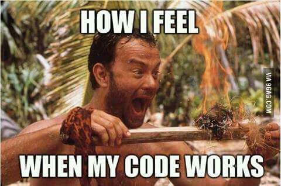

## Doing more with R
<div class = "blue">
* What is R  
* Installing R  
* More than data  
* Resources for learning R  
* Lets code a little


## The what and why of R

<font size="6.5"><div class = "blue">
R is a popular language: concepts apply to all coding/automation
  
   * a set of instructions to complete tasks  
   * FREE!  
   * Packages for many actions:  
       - Data processing and Visualization  
       - Slides for presentations  
       - text for articles, memos, reports  
        
```{r, out.width = "40%", echo=FALSE}

```


## Many uses for R beyond the analysis of data 
<div class = "blue">
*Install R:  https://cran.rstudio.com/

*Install RStudio: https://www.rstudio.com/products/rstudio/hownload/
<div class="centered"><b>
```{r, out.width = "40%", figure.height = "60%", out.extra='style="background-color: #0055A4; padding:2px;"', echo = FALSE}

knitr::include_graphics("Rstudio.png")

```
</div></b>
<br>
*Install tidyverse: install.packages("tidyverse")

*version control: github.com


## The what and why of R
<br>
<font size="6.5">Why code? I'm not running fancy models...  
 
<div class ="centered"><div class = "blue"><b>
*Efficiency 
*Accuracy  
*Reproducibility  

</div></b>
 </font>

## Improving your Effeciency on repetitive tasks
<br>
<div class="centered">
```{r, out.width = "70%", figure.height = "60%", out.extra='style="background-color: #0055A4; padding:2px;"', echo = FALSE}

knitr::include_graphics("repetative task chart.png")

```


## May different types of products
```{r, out.width = "350px", echo= FALSE, out.extra='style="background-color: #0055A4; padding:2px; display: inline-block;"'}
#knitr::include_graphics("tableCapture.PNG")
```
&nbsp;
```{r, out.width = "400px", echo= FALSE, out.extra='style="background-color: #0055A4; padding:2px; display: inline-block;"'}
knitr::include_graphics("ArticleScreenShot.PNG")
```
<br>
<div class="centered">
```{r, out.width = "600px", out.extra='style="background-color: #0055A4; padding:2px; display: inline-block;"' , echo= FALSE}
#knitr::include_graphics("excelCapture.PNG")
```
</div>


</div>
## Slide with R Output example Latreese code

```{r cars, fig.align='center', echo = FALSE}
summary(cars)
```
Some statement or bullet points regarding the data

## Slide with 4 Plots from LaTreese code

```{r pressure, echo = FALSE}
plot(pressure)

```
- This is summary text: there is an increasing trend in the data of the blah

## The 'meta' moment

<div class="centered"><b>
You've been looking at a simple R markdown presentation this entire time 
</div></b>
<br>
<div class="columns-2">
```{r, out.width = "100%", echo=FALSE}

```

```{r, out.width = "350px", echo=FALSE}

```

## Possibilities are Endless

- Improve your skills - a few places I've used to get started  

<div class="centered">
```{r, out.width = "600px", echo = FALSE}
knitr::include_graphics("OurCodingClubCapture.PNG")
```

[Our Coding Club ](https://ourcodingclub.github.io/)

## Skill building

An introduction to R
https://cran.r-project.org/doc/manuals/r-release-R-intro.pdf

R for Data Science
http://r4ds.had.co.nz/

RStudio Cheat Sheets
https://www.rstudio.com/resources/cheatsheets/


## Lets Code!


 


</div>
